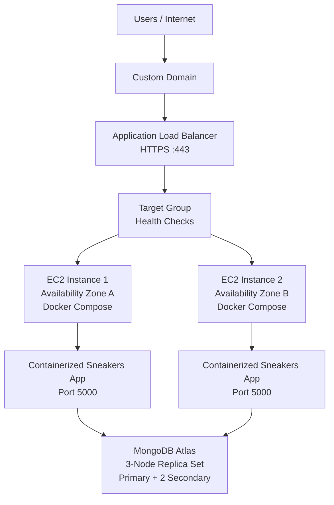

# Containerized Sneakers E-Commerce Deployment on AWS EC2 with Docker Compose, Load Balancing & HTTPS

A full-stack sneakers e-commerce application containerized with Docker and deployed across **two Amazon EC2 instances in different Availability Zones**.

The goal of this project was to build a more reliable deployment by avoiding a single EC2 instance, placing an **Application Load Balancer** in front of the application, restricting direct application access through **Security Groups**, connecting the application to a highly available **MongoDB Atlas** cluster, and securing the application with **HTTPS**.

---

## 🏗️ Architecture



### Request Flow

```text
User
  ↓
Custom Domain
  ↓
Application Load Balancer
  ↓
Target Group
  ↓
Healthy EC2 Instance
  ↓
Docker Container
  ↓
MongoDB Atlas
```

The two EC2 instances run the same application, so if one instance becomes unhealthy, the load balancer can continue sending traffic to the healthy instance.

---

## 🎯 Project Goal

I wanted to deploy the application in a way that was more reliable and secure than running it on a single EC2 instance.

The main goals were:

* Avoid a single point of failure
* Run the application on two EC2 instances
* Deploy the application using Docker and Docker Compose
* Use MongoDB Atlas instead of running MongoDB inside a container
* Distribute traffic using an Application Load Balancer
* Monitor instance health using ALB health checks
* Prevent direct internet access to the application port
* Use a custom domain instead of the ALB DNS name
* Secure the application with HTTPS

---

## 🛠️ Technologies Used

* **AWS EC2** — Application compute
* **AWS ECR** — Docker image storage
* **Docker** — Application containerization
* **Docker Compose** — Running the application container
* **AWS Application Load Balancer** — Traffic distribution
* **AWS Target Group** — EC2 target registration and health checks
* **AWS Security Groups** — Network access control
* **AWS Certificate Manager (ACM)** — SSL/TLS certificate
* **DNS** — Custom domain routing
* **MongoDB Atlas** — Managed database
* **Node.js / Express** — Backend
* **React** — Frontend
* **MongoDB** — Application database

---

# 🚀 Deployment Process

## 1. Containerized the Application

The original application is a full-stack React and Node.js e-commerce application.

I created a Dockerfile to package the application and its dependencies into a Docker image.

The Docker image contains:

* Node.js runtime
* Backend application
* React production build
* Application dependencies
* Production configuration

The application listens on **port 5000**.

I also created a `.dockerignore` file to prevent unnecessary files such as `node_modules`, `.env`, Git files, and logs from being included in the Docker build.

---

## 2. Built and Stored the Docker Image in Amazon ECR

After creating the Docker image, I pushed it to **Amazon Elastic Container Registry (ECR)**.

```text
Application Source Code
        ↓
Docker Build
        ↓
Docker Image
        ↓
Amazon ECR
```

The EC2 instances pull the application image from ECR when deploying the application.

---

## 3. Deployed the Application to Two EC2 Instances

Instead of deploying the application to only one EC2 instance, I created two instances in different Availability Zones within the same AWS Region.

```text
Availability Zone A
└── EC2 Instance 1
    └── Docker Container

Availability Zone B
└── EC2 Instance 2
    └── Docker Container
```

Both instances run the same application using Docker Compose.

This provides redundancy at the application layer.

If one EC2 instance becomes unavailable, the other instance can continue serving traffic.

---

## 4. Used Docker Compose for Deployment

Docker Compose is used on each EC2 instance to run the application container.

Example deployment command:

```bash
docker compose up -d
```

The Compose configuration:

* Pulls the application image from ECR
* Runs the container on port 5000
* Loads environment variables
* Restarts the container if it stops
* Connects the application to the required Docker network

MongoDB was **not** included as a Docker Compose service because the application uses MongoDB Atlas.

---

# 🗄️ 5. MongoDB Atlas

The application requires MongoDB for storing application data.

Instead of running MongoDB as a container on one of the EC2 instances, I used **MongoDB Atlas** as the managed database service.

The Atlas cluster uses a replica-set architecture with multiple database nodes, providing database redundancy and automatic failover.

```text
EC2 Instance 1 ──┐
                 ├──→ MongoDB Atlas
EC2 Instance 2 ──┘
```

Both application instances connect to the same MongoDB Atlas cluster using the MongoDB connection string.

The database credentials and connection string are provided through environment variables rather than being hard-coded into the application.

---

# ⚖️ 6. Application Load Balancer

To avoid exposing the application directly to users through the EC2 instances, I created an **AWS Application Load Balancer (ALB)**.

Before the ALB:

```text
Internet
   ↓
EC2 Instance
   ↓
Application :5000
```

After introducing the ALB:

```text
Internet
   ↓
Application Load Balancer
   ↓
Target Group
   ↓
Healthy EC2 Instance
   ↓
Application :5000
```

The ALB provides a single entry point for users while distributing traffic between the two EC2 instances.

---

# 🎯 7. Target Group & Health Checks

Before configuring the ALB to forward traffic, I created a target group containing the two EC2 instances.

The target group:

* Registers the EC2 instances
* Defines the application port
* Performs health checks
* Tracks whether each instance is healthy
* Provides the list of targets that the ALB can route traffic to

The health check uses:

```text
Protocol: HTTP
Port: 5000
Path: /
```

If an instance fails its health checks, the ALB stops routing new requests to that unhealthy instance.

For example:

```text
                 ALB
                  ↓
             Target Group
             ↙           ↘
        EC2 #1          EC2 #2
        Healthy         Unhealthy
           ↓
        Traffic
```

This means the application can continue serving users even when one application instance becomes unhealthy.

---

# 🔐 8. Security Groups

Security Groups were used to control how traffic reaches the application.

### ALB Security Group

The load balancer accepts web traffic from the internet:

```text
HTTP   :80   → Internet
HTTPS  :443  → Internet
```

### EC2 Security Group

The EC2 application port is **not open to the entire internet**.

Instead:

```text
ALB Security Group
        ↓
EC2 Port 5000
```

Port 5000 only accepts application traffic from the ALB security group.

This prevents users from directly accessing the application through the EC2 public IP and port 5000.

The ALB becomes the public entry point for the application.

---

# 🌐 9. Custom Domain

The Application Load Balancer automatically provides an AWS DNS name.

Instead of asking users to access the application using the AWS-generated ALB DNS name, I configured a custom domain.

The DNS record points the custom domain to the ALB.

```text
sneakers.devs.surf
        ↓
Application Load Balancer
        ↓
Target Group
        ↓
EC2 Instances
```

This provides a cleaner and more user-friendly URL.

---

# 🔒 10. HTTPS with AWS Certificate Manager

I secured the application using **HTTPS**.

I requested an SSL/TLS certificate through **AWS Certificate Manager (ACM)** for the custom domain.

The certificate was validated through DNS.

After the certificate was issued, I configured an HTTPS listener on the Application Load Balancer:

```text
HTTPS :443
      ↓
Target Group
      ↓
EC2 :5000
```

The ALB handles the HTTPS connection from the user and forwards the request to the application.

The final application is therefore accessed securely using:

```text
https://sneakers.devs.surf
```

---

# 🔄 Complete Deployment Flow

The final architecture works like this:

```text
1. User opens the custom domain
              ↓
2. DNS resolves the domain to the ALB
              ↓
3. ALB receives the HTTPS request
              ↓
4. ALB checks the target group's health status
              ↓
5. ALB routes traffic to a healthy EC2 instance
              ↓
6. EC2 receives the request on port 5000
              ↓
7. Docker container serves the application
              ↓
8. Application communicates with MongoDB Atlas
```

---

# 🧪 High Availability Test

To test the redundancy of the deployment, one of the application instances can be stopped.

Expected behaviour:

```text
Before failure:

ALB
├── EC2 #1 → Healthy
└── EC2 #2 → Healthy


After EC2 #1 failure:

ALB
├── EC2 #1 → Unhealthy
└── EC2 #2 → Healthy
                    ↓
              Traffic continues
```

The ALB detects that the failed instance is unhealthy and stops routing traffic to it.

This demonstrates how using multiple application instances removes the single point of failure at the application-server level.

---

# 🔧 Problems I Encountered & Troubleshooting

During the deployment, I worked through several issues, including:

### ECR Authentication

Initially, the EC2 instance could not authenticate with Amazon ECR because AWS credentials/permissions were not correctly configured.

I configured the required IAM access so the EC2 instance could pull the Docker image from ECR.

### MongoDB Atlas Connectivity

The application initially could not connect to MongoDB Atlas because the EC2 environment was not permitted by the Atlas network access configuration.

I corrected the Atlas access configuration and verified the database connection.

### ALB Target Health

The ALB initially reported the EC2 targets as unhealthy because traffic from the load balancer was not correctly permitted to reach the application.

I reviewed the Security Group rules and corrected the network access between the ALB and EC2 instances.

### HTTPS Listener

I initially configured the wrong listener protocol on port 443.

The listener was configured as HTTP instead of HTTPS, which caused an SSL protocol error.

I corrected the listener to:

```text
HTTPS :443
```

and attached the ACM certificate.

### Direct EC2 Access

The EC2 application port was initially exposed more broadly.

I restricted port 5000 so that application traffic could only come from the ALB security group.

---

# 🔑 Key DevOps Concepts Demonstrated

This project gave me practical experience with:

* Docker containerization
* Docker Compose
* Amazon EC2
* Amazon ECR
* Application Load Balancing
* Target groups
* Health checks
* AWS Security Groups
* Availability Zones
* DNS configuration
* HTTPS / SSL/TLS
* AWS Certificate Manager
* Environment-based configuration
* MongoDB Atlas
* High availability
* Troubleshooting AWS networking
* Production-style application deployment

---

# 📁 DevOps Repository Structure

```text
sneakers-aws-devops-deployment/
│
├── README.md
│
├── docker/
│   ├── Dockerfile
│   ├── docker-compose.yml
│   └── .dockerignore
│
├── architecture/
│   └── architecture.png
│
├── docs/
│   └── AWS-DEPLOYMENT.md
│
└── .env.example
```

> **Note:** Actual environment variables and secrets are not included in this repository. The `.env` file is kept outside GitHub.

---

# 📌 Project Outcome

I successfully deployed the sneakers e-commerce application as a containerized workload across two EC2 instances in different Availability Zones.

The final setup provides:

* Two application instances for redundancy
* Docker-based deployment
* Amazon ECR for image storage
* MongoDB Atlas for the managed database
* Application Load Balancer for traffic distribution
* Target-group health checks
* Security Groups controlling network access
* Custom DNS
* HTTPS using AWS Certificate Manager

The final architecture provides a more reliable and secure deployment than exposing a single EC2 instance directly to the internet.

---

## 👩🏽‍💻 What I Worked On

The original project is a full-stack sneakers e-commerce application.

My work on this project focused on the **DevOps and cloud deployment side**, including:

* Containerizing the application with Docker
* Creating the Docker Compose deployment
* Building and pushing images to Amazon ECR
* Deploying the application to multiple EC2 instances
* Configuring the Application Load Balancer
* Creating and configuring the target group
* Setting up health checks
* Configuring Security Groups
* Connecting the application to MongoDB Atlas
* Configuring DNS
* Setting up HTTPS with AWS Certificate Manager
* Troubleshooting deployment, networking, and SSL issues

This project demonstrates how I took a full-stack application and built a **containerized, load-balanced, HTTPS-enabled AWS deployment** around it.
